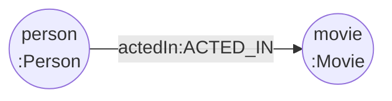
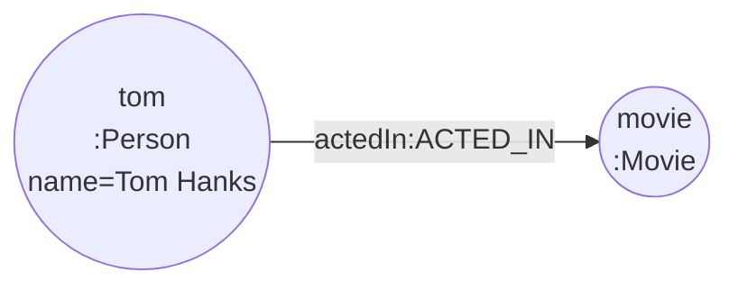
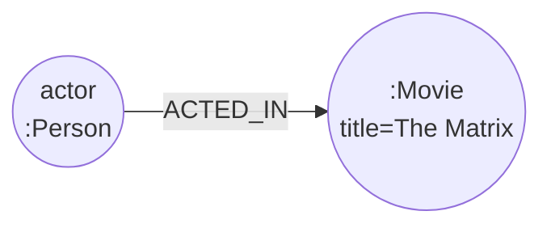
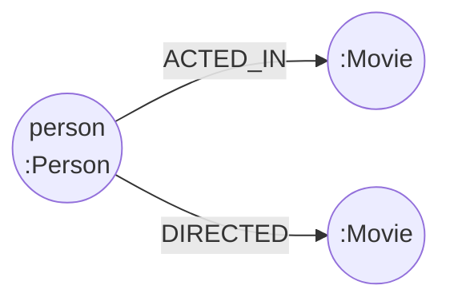

# 05-01. Neo4j Browser 탐험

Source: <https://wikidocs.net/319213>

## 핵심 요약

Neo4j Browser는 Neo4j를 처음 배울 때 쓰는 웹 UI입니다. 여기에서 Cypher를 실행하고,
결과를 그래프/테이블/텍스트/JSON 형태로 확인하며, 노드 라벨과 관계 유형 같은 메타데이터를 살펴볼 수 있습니다.

## 접속 흐름

1. Neo4j Desktop에서 실습 DB를 시작합니다.
2. Browser를 열거나 `http://localhost:7474`로 접속합니다.
3. 사용자명 `neo4j`와 Part 03에서 정한 비밀번호로 로그인합니다.

## Browser 명령과 Cypher 구분

`:play movies` 같은 명령은 **Neo4j Browser 전용 명령**입니다. 일반 Cypher가 아니므로 Python 드라이버나 `.cypher` 실행 파일에 넣지 않습니다.

```text
:play movies
```

위 명령으로 영화 샘플 데이터 가이드를 열고, 안내 슬라이드에서 제공하는 로드 쿼리를 실행합니다.

## 자주 쓰는 단축키

| 단축키 | 용도 |
| --- | --- |
| `Ctrl + Enter` | 현재 쿼리 실행 |
| `Ctrl + /` | 선택 영역 주석 처리 |
| `Ctrl + Space` | 자동 완성 |

## 화면에서 확인할 것

- 왼쪽 사이드바: `Movie`, `Person` 같은 노드 라벨
- Relationship Types: `ACTED_IN`, `DIRECTED`, `PRODUCED`, `WROTE`, `REVIEWED` 등
- 결과 영역: Graph/Table/Text/Code 모드 전환

## Cypher 예제

아래 예제는 `cypher/05_01_neo4j_browser.cypher`에도 동일한 실행용 형태로 들어 있습니다.
Mermaid 다이어그램은 쿼리가 찾는 **Neo4j 노드-관계 패턴**이 분명할 때만 추가했습니다.
개수 집계처럼 그래프 구조를 설명하지 않는 쿼리는 다이어그램을 생략했습니다.

### 1. 전체 노드 수 확인

```cypher
MATCH (n)
RETURN count(n) AS totalNodes;
```

### 2. 전체 관계 수 확인

```cypher
MATCH ()-[r]->()
RETURN count(r) AS totalRelationships;
```

### 3. 라벨 조합별 노드 수 확인

```cypher
MATCH (n)
RETURN labels(n) AS labels, count(*) AS count
ORDER BY count DESC, labels;
```

### 4. 관계 유형별 개수 확인

```cypher
MATCH ()-[r]->()
RETURN type(r) AS relationshipType, count(*) AS count
ORDER BY count DESC, relationshipType;
```

### 5. 배우-영화 관계 일부 시각화

```cypher
MATCH (person:Person)-[actedIn:ACTED_IN]->(movie:Movie)
RETURN person, actedIn, movie
LIMIT 25;
```

**다이어그램: 하나의 `Person` 노드가 `ACTED_IN` 관계로 하나의 `Movie` 노드에 연결되는 Neo4j 그래프 패턴입니다.**



### 6. Tom Hanks와 연결된 영화 확인

```cypher
MATCH (tom:Person {name: "Tom Hanks"})-[actedIn:ACTED_IN]->(movie:Movie)
RETURN tom, actedIn, movie;
```

**다이어그램: `Tom Hanks` 사람 노드가 그가 출연한 모든 영화 노드에 연결되는 Neo4j 그래프 패턴입니다.**



### 7. The Matrix 출연진을 테이블로 확인

```cypher
MATCH (actor:Person)-[:ACTED_IN]->(:Movie {title: "The Matrix"})
RETURN actor.name AS actor
ORDER BY actor;
```

**다이어그램: 여러 `Person` 노드가 `ACTED_IN` 관계로 `The Matrix` 영화 노드에 연결되는 Neo4j 그래프 패턴입니다.**



### 8. 배우이면서 감독인 사람 찾기

```cypher
MATCH (person:Person)-[:ACTED_IN]->(:Movie)
MATCH (person)-[:DIRECTED]->(:Movie)
RETURN DISTINCT person.name AS person
ORDER BY person
LIMIT 25;
```

**다이어그램: 하나의 `Person` 노드가 `ACTED_IN`과 `DIRECTED` 관계를 모두 가지는 Neo4j 그래프 패턴입니다.**



## 실습 체크리스트

- [ ] 영화 샘플 데이터를 로드했다.
- [ ] 전체 노드 수와 관계 수를 확인했다.
- [ ] `Person`과 `Movie` 라벨이 보이는지 확인했다.
- [ ] 배우-영화 관계를 Graph 모드로 시각화했다.
- [ ] 같은 결과를 Table 모드에서도 확인했다.

## 연습 질문

1. 그래프 모드는 언제 유용하고, 테이블 모드는 언제 유용한가?
2. `ACTED_IN` 관계의 방향은 누구에서 누구로 향하는가?
3. 사이드바의 라벨/관계 목록만 보고 데이터 모델을 어떻게 추측할 수 있는가?
