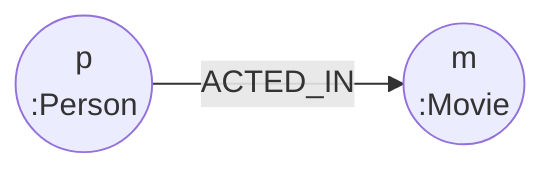
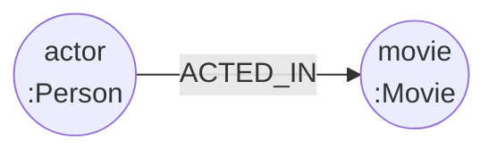
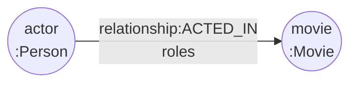
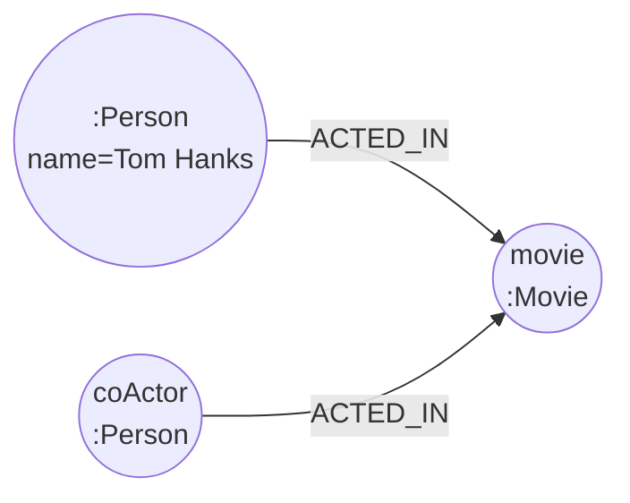
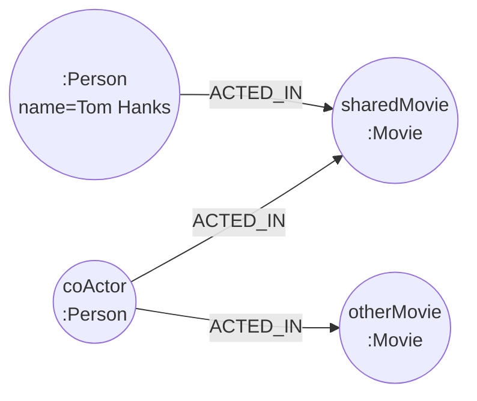
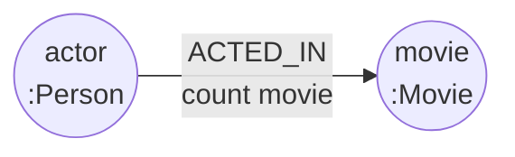
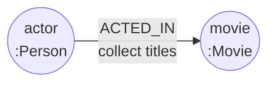
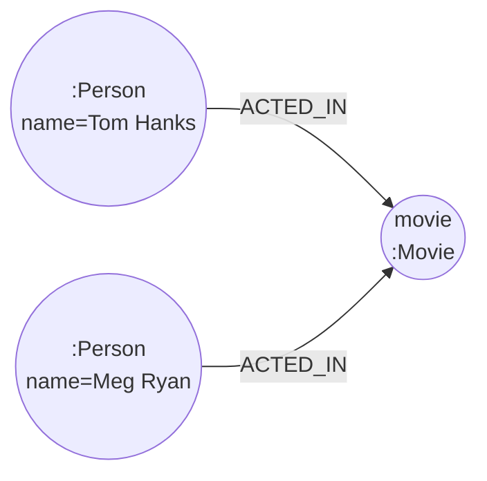

# 05-02. Cypher 첫걸음 - 읽기

Source: <https://wikidocs.net/319215>

## 기본 구조

읽기 쿼리는 보통 다음 순서로 생각합니다.

```cypher
MATCH (pattern)
WHERE condition
RETURN result
ORDER BY result
LIMIT number;
```

- `MATCH`: 그래프에서 찾을 모양을 지정합니다.
- `WHERE`: 결과를 조건으로 좁힙니다.
- `RETURN`: 보고 싶은 값만 반환합니다.
- `ORDER BY`, `LIMIT`: 정렬과 개수 제한에 사용합니다.

## 노드 읽기 패턴

| 목적 | 패턴 |
| --- | --- |
| 모든 노드 일부 보기 | `MATCH (n) RETURN n LIMIT 10` |
| 특정 라벨 보기 | `MATCH (p:Person) RETURN p LIMIT 10` |
| 속성으로 찾기 | `MATCH (p:Person {name: "Tom Hanks"}) RETURN p` |

## 관계 읽기 패턴

```cypher
MATCH (p:Person)-[:ACTED_IN]->(m:Movie)
RETURN p.name, m.title;
```

**다이어그램: 배우 노드에서 영화 노드로 이어지는 기본 `ACTED_IN` 관계 패턴입니다.**



- `->`: 왼쪽 노드에서 오른쪽 노드로 향하는 관계
- `<-`: 오른쪽 노드에서 왼쪽 노드로 들어오는 관계
- `-`: 방향을 신경 쓰지 않는 관계
- `[r:TYPE]`: 관계 자체를 변수 `r`에 담아 `type(r)` 또는 관계 속성을 볼 수 있습니다.

## 필터링 메모

- 숫자 비교: `m.released >= 2000`
- 문자열 포함: `p.name CONTAINS "Tom"`
- 접두어: `m.title STARTS WITH "The"`
- 복합 조건: `AND`, `OR`, 괄호 사용

## Cypher 예제

아래 예제는 `cypher/05_02_cypher_read.cypher`에도 동일한 실행용 형태로 들어 있습니다.
Mermaid 다이어그램은 쿼리가 찾는 **Neo4j 노드-관계 패턴**이 분명할 때만 추가했습니다.
단일 노드 필터나 스칼라 결과 중심 쿼리는 다이어그램을 생략했습니다.

### 1. 라벨과 관계 유형을 구분하지 않고 노드 일부 보기

```cypher
MATCH (n)
RETURN n
LIMIT 10;
```

### 2. Person 노드를 테이블 데이터로 읽기

```cypher
MATCH (person:Person)
RETURN person.name AS name, person.born AS born
ORDER BY name
LIMIT 10;
```

### 3. 2000년 이후 개봉 영화 찾기

```cypher
MATCH (movie:Movie)
WHERE movie.released >= 2000
RETURN movie.title AS title, movie.released AS released
ORDER BY released, title
LIMIT 20;
```

### 4. 속성값으로 사람 찾기

```cypher
MATCH (person:Person {name: "Tom Hanks"})
RETURN person.name AS name, person.born AS born;
```

### 5. 문자열 포함 조건으로 사람 찾기

```cypher
MATCH (person:Person)
WHERE person.name CONTAINS "Tom"
RETURN person.name AS name
ORDER BY name;
```

### 6. 배우에서 영화로 향하는 관계 따라가기

```cypher
MATCH (actor:Person)-[:ACTED_IN]->(movie:Movie)
RETURN actor.name AS actor, movie.title AS movie
ORDER BY actor, movie
LIMIT 15;
```

**다이어그램: 하나의 `Person` 배우 노드가 `ACTED_IN` 관계로 하나의 `Movie` 노드에 연결되는 패턴입니다.**



### 7. 관계를 변수로 잡고 관계 속성 확인하기

```cypher
MATCH (actor:Person)-[relationship:ACTED_IN]->(movie:Movie)
RETURN actor.name AS actor,
       type(relationship) AS relationshipType,
       relationship.roles AS roles,
       movie.title AS movie
LIMIT 15;
```

**다이어그램: `ACTED_IN` 관계를 변수로 잡아 관계 속성까지 반환하는 Neo4j 그래프 패턴입니다.**



### 8. 2-hop 패턴으로 공동 출연자 찾기

```cypher
MATCH (:Person {name: "Tom Hanks"})-[:ACTED_IN]->(movie:Movie)<-[:ACTED_IN]-(coActor:Person)
RETURN DISTINCT coActor.name AS coActor
ORDER BY coActor
LIMIT 25;
```

**다이어그램: Tom Hanks와 공동 출연자가 같은 영화 노드를 통해 연결되는 2-hop 그래프 패턴입니다.**



### 9. 공동 출연자를 거쳐 다른 영화 찾기

```cypher
MATCH (:Person {name: "Tom Hanks"})-[:ACTED_IN]->(sharedMovie:Movie)<-[:ACTED_IN]-(coActor:Person)-[:ACTED_IN]->(otherMovie:Movie)
WHERE sharedMovie <> otherMovie
RETURN DISTINCT coActor.name AS viaCoActor, otherMovie.title AS otherMovie
ORDER BY viaCoActor, otherMovie
LIMIT 25;
```

**다이어그램: Tom Hanks에서 공동 출연자를 거쳐 다른 영화로 확장되는 다단계 그래프 탐색 패턴입니다.**



### 10. 배우별 출연 영화 수 세기

```cypher
MATCH (actor:Person)-[:ACTED_IN]->(movie:Movie)
RETURN actor.name AS actor, count(movie) AS movieCount
ORDER BY movieCount DESC, actor
LIMIT 10;
```

**다이어그램: 배우별 `ACTED_IN` 관계 수를 세는 그래프 집계 패턴입니다.**



### 11. 배우별 출연 영화 목록 모으기

```cypher
MATCH (actor:Person)-[:ACTED_IN]->(movie:Movie)
WITH actor, collect(movie.title) AS movies, count(movie) AS movieCount
WHERE movieCount >= 3
RETURN actor.name AS actor, movieCount, movies
ORDER BY movieCount DESC, actor
LIMIT 10;
```

**다이어그램: 배우별 출연 영화 제목을 목록으로 모으는 그래프 집계 패턴입니다.**



### 12. 두 배우의 공통 출연 영화 찾기

```cypher
MATCH (:Person {name: "Tom Hanks"})-[:ACTED_IN]->(movie:Movie)<-[:ACTED_IN]-(:Person {name: "Meg Ryan"})
RETURN movie.title AS commonMovie
ORDER BY commonMovie;
```

**다이어그램: Tom Hanks와 Meg Ryan이 같은 영화 노드에 함께 연결되는 공통 출연 영화 패턴입니다.**



## 다단계 탐색 메모

GraphRAG 관점에서 중요한 부분입니다. 하나의 벡터 검색 결과만 보는 대신,
그래프 관계를 따라가며 주변 문맥을 확장할 수 있습니다.

예: `배우 -> 영화 <- 공동출연배우 -> 다른 영화`

## 집계 패턴

| 목적 | Cypher |
| --- | --- |
| 개수 세기 | `count(*)`, `count(m)` |
| 목록으로 모으기 | `collect(m.title)` |
| 중복 제거 | `DISTINCT` |
| 큰 값부터 정렬 | `ORDER BY countValue DESC` |

## 흔한 실수

- `MATCH (p:Person)` 뒤에 `RETURN` 없이 실행하기
- 관계 방향을 반대로 써서 결과가 0개 나오는 경우
- 같은 사람이 결과에 반복될 때 `DISTINCT`를 빼먹는 경우
- 큰 그래프에서 `LIMIT` 없이 전체를 시각화하려는 경우
