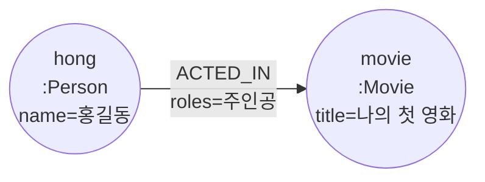
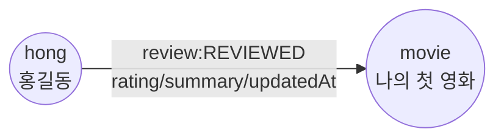
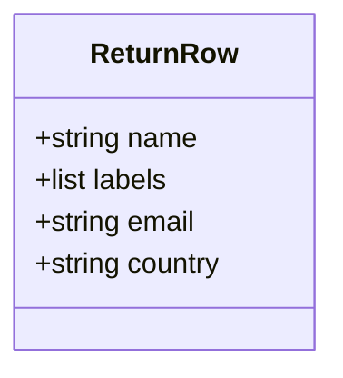
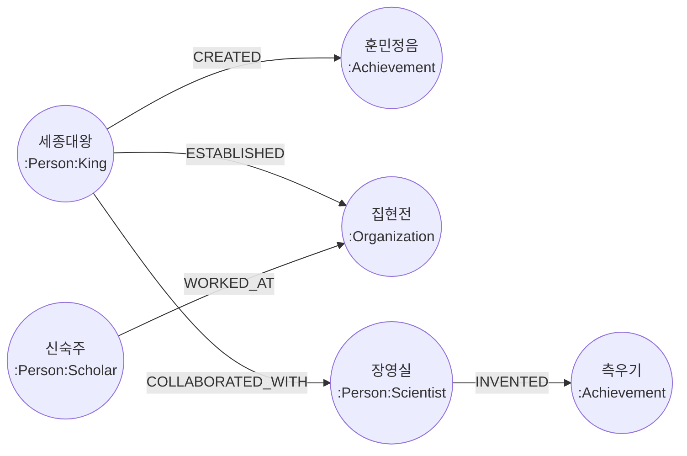
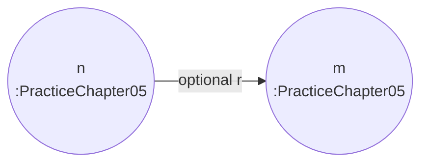

# 05-03. Cypher로 데이터 만들기

Source: <https://wikidocs.net/319216>

## 핵심 요약

이 섹션은 Cypher의 쓰기 작업을 다룹니다.

| 명령 | 의미 | 주의점 |
| --- | --- | --- |
| `CREATE` | 항상 새 노드/관계 생성 | 여러 번 실행하면 중복 생성 가능 |
| `MERGE` | 있으면 매칭, 없으면 생성 | 고유하게 판단할 속성을 잘 골라야 함 |
| `SET` | 속성 변경 또는 라벨 추가 | 기존 값을 덮어쓸 수 있음 |
| `DELETE` | 관계 없는 노드 또는 관계 삭제 | 관계가 있는 노드는 바로 삭제 불가 |
| `DETACH DELETE` | 관계까지 함께 삭제 | 실습 데이터에만 신중히 사용 |

## CREATE vs MERGE

- `CREATE`는 “새로 만들기”가 목적입니다.
- `MERGE`는 “이미 있으면 재사용하고, 없으면 만들기”가 목적입니다.

연습 중 같은 쿼리를 여러 번 실행할 수 있으므로, 학습 노트의 예제는 가능한 한 `MERGE`를 많이 사용합니다.

## 삭제 안전 규칙

1. 삭제 전에는 먼저 `MATCH ... RETURN ...`으로 대상 확인
2. 연습용 라벨이나 이름 범위를 좁혀 삭제
3. `DETACH DELETE`는 전체 DB가 아니라 실습 노드에만 사용
4. 영화 샘플 데이터와 직접 섞이는 이름은 조심

## Cypher 예제

아래 예제는 `cypher/05_03_cypher_write.cypher`에도 동일한 실행용 형태로 들어 있습니다.
이 파일의 쿼리는 DB 상태를 바꾸므로 연습용 데이터베이스에서 실행하세요.
Mermaid 다이어그램은 생성/조회하려는 **Neo4j 노드-관계 패턴**이 분명할 때 추가했습니다.
또한 그래프 패턴은 아니지만 학습에 도움이 되는 경우, 예를 들어 `RETURN` 결과 형태는 별도 다이어그램으로 표현했습니다.
삭제나 단일 노드 생성처럼 구조를 설명하기 애매한 쿼리는 다이어그램을 생략했습니다.

### 0. 재실행 전 연습 데이터 정리

```cypher
MATCH (n:PracticeChapter05)
DETACH DELETE n;
```

### 1. CREATE로 단일 노드 생성

```cypher
CREATE (hong:Person:PracticeChapter05 {name: "홍길동", born: 1990})
RETURN hong;
```

### 2. 여러 노드를 한 번에 생성

```cypher
CREATE (kim:Person:PracticeChapter05 {name: "김철수", born: 1985})
CREATE (lee:Person:PracticeChapter05 {name: "이영희", born: 1988})
CREATE (park:Person:PracticeChapter05 {name: "박민수", born: 1992})
RETURN kim, lee, park;
```

### 3. 영화를 만들고 기존 사람과 연결

```cypher
CREATE (movie:Movie:PracticeChapter05 {
  title: "나의 첫 영화",
  released: 2024,
  tagline: "그래프로 배우는 첫 Cypher"
})
WITH movie
MATCH (hong:Person:PracticeChapter05 {name: "홍길동"})
CREATE (hong)-[:ACTED_IN {roles: ["주인공"]}]->(movie)
RETURN hong, movie;
```

**다이어그램: 연습용 사람 노드에서 연습용 영화 노드로 `ACTED_IN` 관계를 생성하는 그래프 패턴입니다.**



### 4. MERGE로 중복 없이 사람 생성 또는 매칭

```cypher
MERGE (trainee:Person:PracticeChapter05 {name: "연습 사용자"})
ON CREATE SET trainee.createdAt = datetime()
ON MATCH SET trainee.lastSeen = datetime()
RETURN trainee;
```

### 5. MERGE로 리뷰 관계 생성 또는 매칭

```cypher
MATCH (hong:Person:PracticeChapter05 {name: "홍길동"})
MATCH (movie:Movie:PracticeChapter05 {title: "나의 첫 영화"})
MERGE (hong)-[review:REVIEWED]->(movie)
ON CREATE SET review.rating = 5, review.summary = "연습용 리뷰"
ON MATCH SET review.updatedAt = datetime()
RETURN hong, review, movie;
```

**다이어그램: 연습용 사람 노드에서 연습용 영화 노드로 `REVIEWED` 관계를 생성하거나 매칭하는 그래프 패턴입니다.**



### 6. SET으로 속성과 라벨 추가

```cypher
MATCH (hong:Person:PracticeChapter05 {name: "홍길동"})
SET hong.email = "hong@example.com",
    hong.country = "Korea",
    hong:Actor
RETURN hong.name AS name, labels(hong) AS labels, hong.email AS email, hong.country AS country;
```

**다이어그램: `SET` 쿼리가 업데이트된 `hong` 노드에서 추출해 반환하는 결과 객체의 형태입니다.**



### 7. 한국 역사 연습 그래프 만들기

```cypher
MERGE (sejong:Person:King:PracticeChapter05 {name: "세종대왕"})
  ON CREATE SET sejong.born = 1397, sejong.died = 1450
MERGE (jang:Person:Scientist:PracticeChapter05 {name: "장영실"})
  ON CREATE SET jang.born = 1390
MERGE (shin:Person:Scholar:PracticeChapter05 {name: "신숙주"})
  ON CREATE SET shin.born = 1417
MERGE (hangul:Achievement:PracticeChapter05 {name: "훈민정음"})
  ON CREATE SET hangul.year = 1443
MERGE (rainGauge:Achievement:PracticeChapter05 {name: "측우기"})
  ON CREATE SET rainGauge.year = 1441
MERGE (jiphyeonjeon:Organization:PracticeChapter05 {name: "집현전"})
MERGE (sejong)-[:CREATED]->(hangul)
MERGE (sejong)-[:ESTABLISHED]->(jiphyeonjeon)
MERGE (jang)-[:INVENTED]->(rainGauge)
MERGE (sejong)-[:COLLABORATED_WITH]->(jang)
MERGE (shin)-[:WORKED_AT]->(jiphyeonjeon)
RETURN sejong, jang, shin, hangul, rainGauge, jiphyeonjeon;
```

**다이어그램: `MERGE` 문으로 생성하거나 매칭하는 한국 역사 연습 그래프의 노드-관계 구조입니다.**



### 8. 연습 그래프 전체 확인

```cypher
MATCH (n:PracticeChapter05)
OPTIONAL MATCH (n)-[r]->(m:PracticeChapter05)
RETURN n, r, m;
```

**다이어그램: 두 `PracticeChapter05` 노드 사이에 존재할 수 있는 임의의 관계를 조회하는 그래프 패턴입니다.**



### 9. 관계만 삭제

```cypher
MATCH (:Person:PracticeChapter05 {name: "홍길동"})-[review:REVIEWED]->(:Movie:PracticeChapter05 {title: "나의 첫 영화"})
DELETE review;
```

### 10. 연습 노드 삭제

```cypher
MATCH (p:Person:PracticeChapter05 {name: "김철수"})
DETACH DELETE p;
```

### 11. 전체 연습 데이터 최종 정리

아래 쿼리는 실행 파일에서는 안전을 위해 주석 처리되어 있습니다. 필요할 때 주석을 해제하고 실행합니다.

```cypher
MATCH (n:PracticeChapter05)
DETACH DELETE n;
```

## 이 프로젝트의 실습 데이터 모델

```text
(:Person:King {name: "세종대왕"})-[:CREATED]->(:Achievement {name: "훈민정음"})
(:Person:Scientist {name: "장영실"})-[:INVENTED]->(:Achievement {name: "측우기"})
(:Person:Scholar {name: "신숙주"})-[:WORKED_AT]->(:Organization {name: "집현전"})
```

## 연습 질문

1. `CREATE`로 같은 사람을 두 번 만들면 어떤 문제가 생기는가?
2. `MERGE`에서 `name`만 키로 쓰면 충분한가? 동명이인은 어떻게 다룰 수 있을까?
3. 관계를 삭제하지 않고 연결된 노드를 삭제하려고 하면 왜 실패할까?
4. GraphRAG에서 노드 속성과 관계 유형 이름은 왜 중요할까?
