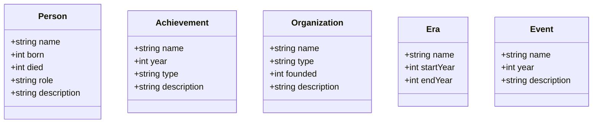
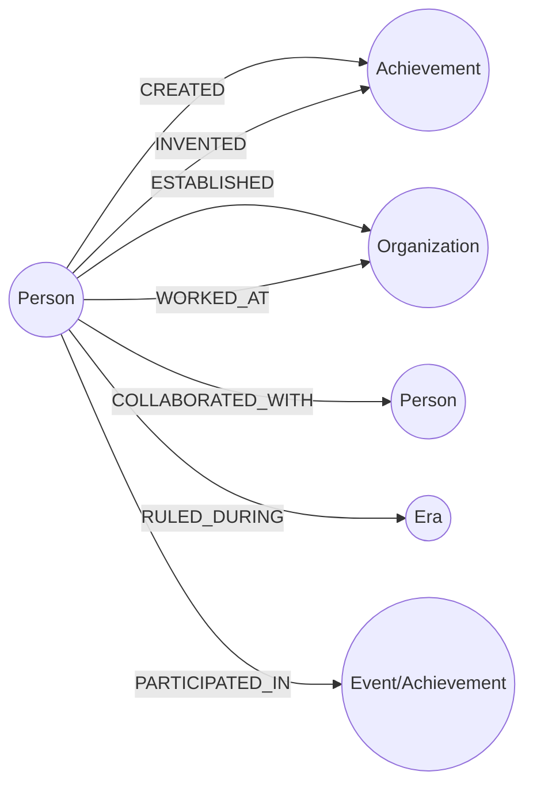

# 06-01. 지식 그래프 스키마 설계

Source: <https://wikidocs.net/319219>

## 핵심 요약

스키마는 지식 그래프의 설계도입니다. 어떤 노드 라벨을 만들지, 각 노드가 어떤 속성을 가질지,
노드 사이에 어떤 관계 유형을 둘지 먼저 정해야 이후 Cypher 작성과 GraphRAG 검색이 안정적입니다.

## 스키마 설계 프로세스

1. 도메인 이해
2. 엔티티 유형 정의
3. 속성 정의
4. 관계 유형 정의
5. 제약조건 설정

**다이어그램: 지식 그래프 스키마를 설계하는 순서입니다.**


## 조선시대 역사 그래프의 엔티티 유형

| 라벨 | 의미 | 예시 |
| --- | --- | --- |
| `Person` | 역사적 인물 | 세종대왕, 장영실, 성삼문 |
| `Achievement` | 업적/발명 | 훈민정음, 측우기, 앙부일구 |
| `Organization` | 기관/조직 | 집현전 |
| `Era` | 시대/왕조 | 조선시대 |
| `Event` | 역사적 사건 | 임진왜란 |

**다이어그램: Chapter 6에서 설계하는 핵심 엔티티와 속성 구조입니다.**



## 관계 유형

| 관계 | 시작 → 끝 | 의미 |
| --- | --- | --- |
| `CREATED` | `Person` → `Achievement` | 창제/제작했다 |
| `INVENTED` | `Person` → `Achievement` | 발명했다 |
| `ESTABLISHED` | `Person` → `Organization` | 설립했다 |
| `WORKED_AT` | `Person` → `Organization` | 근무/활동했다 |
| `COLLABORATED_WITH` | `Person` → `Person` | 협력했다 |
| `RULED_DURING` | `Person` → `Era` | 해당 시대에 통치했다 |
| `PARTICIPATED_IN` | `Person` → `Event` 또는 `Achievement` | 참여했다 |

**다이어그램: 설계한 노드 라벨 사이의 대표 관계 방향입니다.**



## Neo4j에서 스키마 확인

### 현재 스키마 시각화

```cypher
CALL db.schema.visualization();
```

### 라벨별 노드 수 확인

```cypher
CALL db.labels() YIELD label
CALL {
  WITH label
  MATCH (n)
  WHERE label IN labels(n)
  RETURN count(n) AS count
}
RETURN label, count
ORDER BY count DESC;
```

### 관계 유형 확인

```cypher
CALL db.relationshipTypes() YIELD relationshipType
RETURN relationshipType
ORDER BY relationshipType;
```

## 제약조건

제약조건은 데이터 품질을 지키고 중복을 줄이는 장치입니다.

```cypher
CREATE CONSTRAINT person_name IF NOT EXISTS
FOR (p:Person) REQUIRE p.name IS UNIQUE;
```

```cypher
CREATE CONSTRAINT person_name_exists IF NOT EXISTS
FOR (p:Person) REQUIRE p.name IS NOT NULL;
```

```cypher
SHOW CONSTRAINTS;
```

## 좋은 스키마 체크리스트

- [ ] 질문에 답하기 위해 필요한 노드/관계만 포함했는가?
- [ ] 라벨과 관계 이름이 일관적인가?
- [ ] 관계 방향이 자연스럽고 쿼리하기 쉬운가?
- [ ] 중복을 막기 위한 고유성 제약조건이 있는가?
- [ ] 새 인물/업적/기관을 추가하기 쉬운가?

## 관련 예제

- `cypher/06_01_schema_design.cypher`
