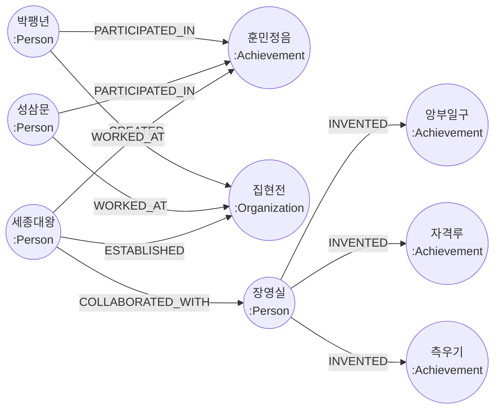
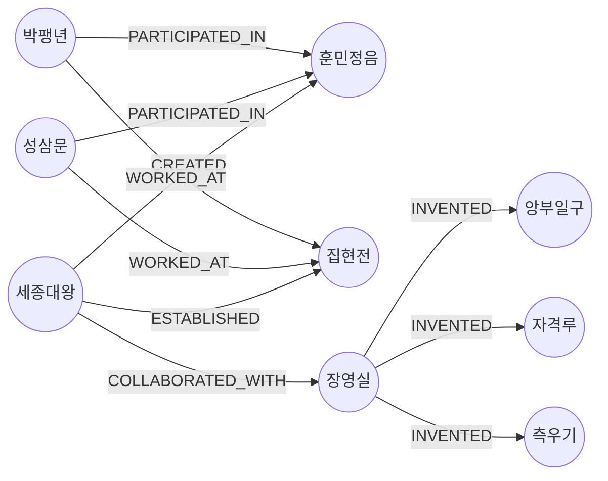
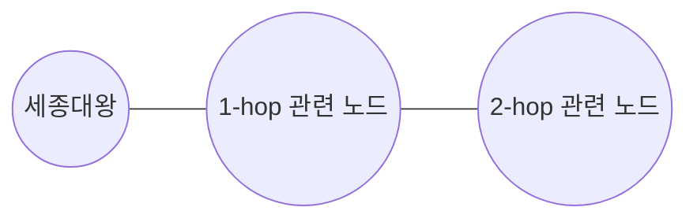

# 06-02. 수동으로 지식 그래프 구축

Source: <https://wikidocs.net/319220>

## 핵심 요약

이 섹션은 세종대왕 중심의 짧은 역사 문장을 직접 분석해 노드와 관계로 변환합니다.
학습 목표는 “문장 → 엔티티 → 관계 → 검증 쿼리” 흐름을 손으로 익히는 것입니다.

## 사용할 데이터에서 추출할 지식

| 원문에서 보이는 정보 | 그래프 표현 |
| --- | --- |
| 세종대왕은 조선의 왕 | `(:Person {name: "세종대왕", role: "왕"})` |
| 세종대왕은 훈민정음을 창제 | `(세종대왕)-[:CREATED]->(훈민정음)` |
| 세종대왕은 집현전을 설치 | `(세종대왕)-[:ESTABLISHED]->(집현전)` |
| 세종대왕은 장영실과 과학 기구를 발명 | `(세종대왕)-[:COLLABORATED_WITH]->(장영실)` |
| 장영실은 앙부일구/자격루/측우기를 발명 | `(장영실)-[:INVENTED]->(발명품)` |
| 성삼문과 박팽년은 집현전 학자 | `(학자)-[:WORKED_AT]->(집현전)` |
| 성삼문과 박팽년은 훈민정음 창제 참여 | `(학자)-[:PARTICIPATED_IN]->(훈민정음)` |

**다이어그램: 수동 구축 대상인 세종대왕 중심 지식 그래프입니다.**



## 실행 순서

1. 연습 데이터 정리
2. 인물 노드 생성
3. 업적/발명 노드 생성
4. 기관 노드 생성
5. 관계 생성
6. 그래프 확인
7. 질문별 Cypher로 검증

## Cypher 예제

아래 예제는 `cypher/06_02_manual_knowledge_graph.cypher`에도 실행용 형태로 들어 있습니다.
쓰기 쿼리이므로 연습용 DB에서 실행하세요.

### 1. 연습 데이터 정리

```cypher
MATCH (n:PracticeChapter06)
DETACH DELETE n;
```

### 2. 인물 노드 생성

```cypher
MERGE (sejong:Person:PracticeChapter06 {name: "세종대왕"})
SET sejong.born = 1397,
    sejong.died = 1450,
    sejong.role = "왕",
    sejong.description = "조선의 제4대 왕, 한글 창제"
MERGE (jang:Person:PracticeChapter06 {name: "장영실"})
SET jang.born = 1390,
    jang.role = "과학자",
    jang.description = "조선 최고의 발명가"
MERGE (sung:Person:PracticeChapter06 {name: "성삼문"})
SET sung.born = 1418,
    sung.died = 1456,
    sung.role = "학자"
MERGE (park:Person:PracticeChapter06 {name: "박팽년"})
SET park.born = 1417,
    park.died = 1456,
    park.role = "학자"
RETURN sejong, jang, sung, park;
```

### 3. 업적/발명 노드 생성

```cypher
MERGE (hangul:Achievement:PracticeChapter06 {name: "훈민정음"})
SET hangul.year = 1443, hangul.type = "문자"
MERGE (sundial:Achievement:PracticeChapter06 {name: "앙부일구"})
SET sundial.year = 1434, sundial.type = "발명"
MERGE (waterclock:Achievement:PracticeChapter06 {name: "자격루"})
SET waterclock.year = 1434, waterclock.type = "발명"
MERGE (raingauge:Achievement:PracticeChapter06 {name: "측우기"})
SET raingauge.year = 1441, raingauge.type = "발명"
RETURN hangul, sundial, waterclock, raingauge;
```

### 4. 기관 노드 생성

```cypher
MERGE (jiphyeon:Organization:PracticeChapter06 {name: "집현전"})
SET jiphyeon.type = "학술기관",
    jiphyeon.founded = 1420,
    jiphyeon.description = "왕실 학술 연구 기관"
RETURN jiphyeon;
```

### 5. 관계 생성

```cypher
MATCH (sejong:Person:PracticeChapter06 {name: "세종대왕"})
MATCH (jang:Person:PracticeChapter06 {name: "장영실"})
MATCH (sung:Person:PracticeChapter06 {name: "성삼문"})
MATCH (park:Person:PracticeChapter06 {name: "박팽년"})
MATCH (hangul:Achievement:PracticeChapter06 {name: "훈민정음"})
MATCH (sundial:Achievement:PracticeChapter06 {name: "앙부일구"})
MATCH (waterclock:Achievement:PracticeChapter06 {name: "자격루"})
MATCH (raingauge:Achievement:PracticeChapter06 {name: "측우기"})
MATCH (jiphyeon:Organization:PracticeChapter06 {name: "집현전"})
MERGE (sejong)-[:CREATED {year: 1443}]->(hangul)
MERGE (sejong)-[:ESTABLISHED]->(jiphyeon)
MERGE (sejong)-[:COLLABORATED_WITH]->(jang)
MERGE (jang)-[:INVENTED]->(sundial)
MERGE (jang)-[:INVENTED]->(waterclock)
MERGE (jang)-[:INVENTED]->(raingauge)
MERGE (sung)-[:WORKED_AT]->(jiphyeon)
MERGE (park)-[:WORKED_AT]->(jiphyeon)
MERGE (sung)-[:PARTICIPATED_IN]->(hangul)
MERGE (park)-[:PARTICIPATED_IN]->(hangul);
```

**다이어그램: 관계 생성 쿼리가 만드는 최종 노드-관계 구조입니다.**



### 6. 그래프 확인

```cypher
MATCH (n:PracticeChapter06)-[r]->(m:PracticeChapter06)
RETURN n, r, m;
```

```cypher
MATCH path = (:Person:PracticeChapter06 {name: "세종대왕"})-[*1..2]-(connected:PracticeChapter06)
RETURN path;
```

**다이어그램: 세종대왕에서 1~2단계 관계까지 확장해 주변 지식을 확인하는 탐색 패턴입니다.**



### 7. 질문에 답하기

```cypher
MATCH (:Person:PracticeChapter06 {name: "세종대왕"})-[:CREATED|ESTABLISHED]->(target)
RETURN target.name AS 이름, labels(target)[0] AS 유형
ORDER BY 이름;
```

```cypher
MATCH (scholar:Person:PracticeChapter06)-[:WORKED_AT]->(:Organization:PracticeChapter06 {name: "집현전"})
RETURN scholar.name AS 학자
ORDER BY 학자;
```

```cypher
MATCH (:Person:PracticeChapter06 {name: "장영실"})-[:INVENTED]->(invention:Achievement)
RETURN invention.name AS 발명품, invention.year AS 연도
ORDER BY 연도, 발명품;
```

```cypher
MATCH (person:Person:PracticeChapter06)-[:CREATED|PARTICIPATED_IN]->(:Achievement:PracticeChapter06 {name: "훈민정음"})
RETURN person.name AS 참여자, person.role AS 역할
ORDER BY 참여자;
```

## Python으로 같은 그래프 만들기

- `src/06_02_01_build_sejong_graph.py`

이 스크립트는 `src/util.py`의 Neo4j 설정을 사용하고, 같은 `PracticeChapter06` 라벨을 붙입니다.

## 흔한 실수

- `CREATE`를 반복 실행해 중복 노드를 만드는 것
- 삭제 쿼리를 너무 넓게 작성해 영화 샘플 데이터까지 지우는 것
- 관계 방향을 일관되게 정하지 않아 질문 쿼리가 복잡해지는 것
- 학습용 데이터와 기존 샘플 데이터를 같은 라벨만으로 구분하려는 것
